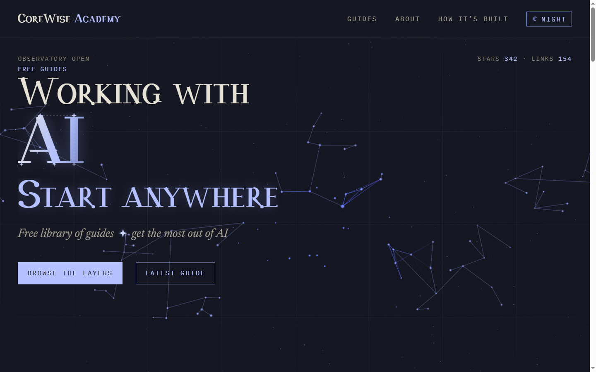
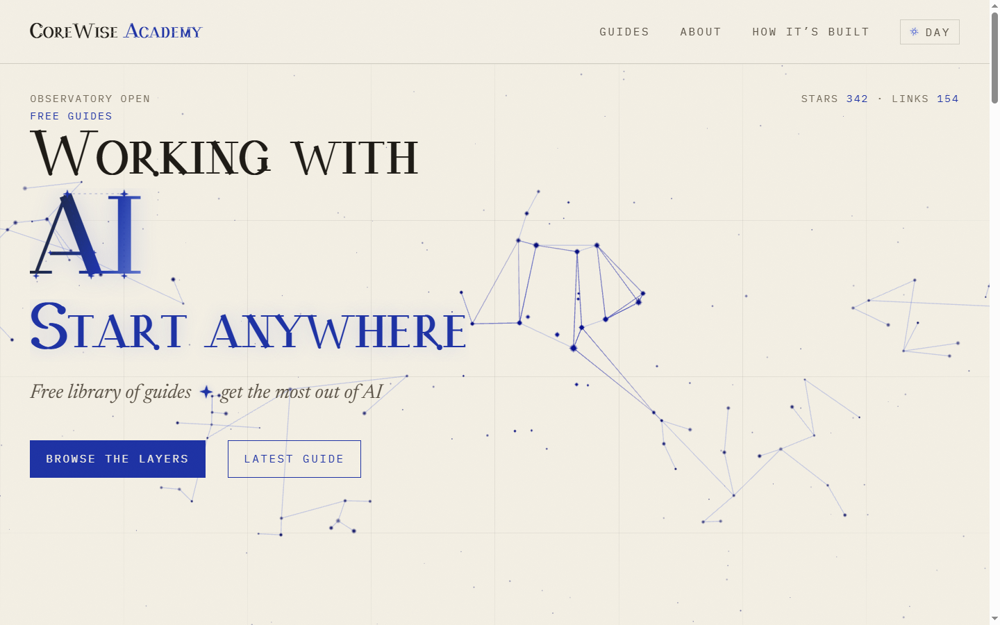

# CoreWise Academy

Free library of original guides on working with AI. 22 guides, about 156 minutes of
reading, no account and no paywall.

Live at **[corewise.academy](https://corewise.academy)**.

<p>
  
  
</p>

## What this is

Every guide distills real sources (lectures, official docs, field notes) into a short
read with objectives, an exercise, and a self-check. The homepage is a star chart of the
curriculum: each star is a guide, each line a prerequisite. Guides that ship a reusable
skill hand you the file itself.

The curriculum sits in five layers, and each layer runs three depths: Broad,
Practitioner, then Deep. Start at the layer that matches your problem.

| | Layer | Guides | What it covers |
|---|---|---|---|
| I | [Foundations](https://corewise.academy/tracks/foundations/) | 3 | How AI models actually work: what they can do, where they fail, and how to tell the difference |
| II | [Prompting & Context](https://corewise.academy/tracks/prompting/) | 6 | Getting the right material in front of the model, arranged so what matters stands out |
| III | [Agents & Automation](https://corewise.academy/tracks/agents/) | 9 | Models that act on their own: tools, MCP, and multi-step workflows that hold up without you watching |
| IV | [Building with AI](https://corewise.academy/tracks/building/) | 2 | Shipping AI features other people can rely on: APIs, retrieval, and evals that prove it works |
| V | [Practice](https://corewise.academy/tracks/practice/) | 2 | The daily habits: verification, taste, and knowing when not to use the model |

## Readable by agents

Point a model at [corewise.academy/llms.txt](https://corewise.academy/llms.txt) and it
gets the whole index in one fetch. Any guide that ships a skill or an agent brief also
serves the raw file at `/guides/<slug>.md`, so an agent can install the thing the guide
describes instead of parsing the page around it.

## Layout

```
site/                    Astro 5 site: pages, components, data
  src/content/guides/    the 22 guides, one .mdx each
  src/data/skills/       skill files the guides hand out
  scripts/               copy gates and audio generation
content/                 source register behind the guides
design/                  mockups and the Alembic titling typeface
```

## Run it

Node 20 or newer.

```bash
cd site
npm install
npm run dev
```

`npm run build` runs the copy gates first, then builds. A build fails on an em dash, an
overlong heading, or a layout the checker rejects, so bad copy never reaches the site.
The same gates run on every pull request.

## Credits

Edited by Ryan D. Allen. Sources for each guide are credited on the guide.

MIT licensed, except skills under `.claude/skills/`, which carry their own terms (see
[PROVENANCE.md](.claude/skills/PROVENANCE.md) and per-skill LICENSE files).
