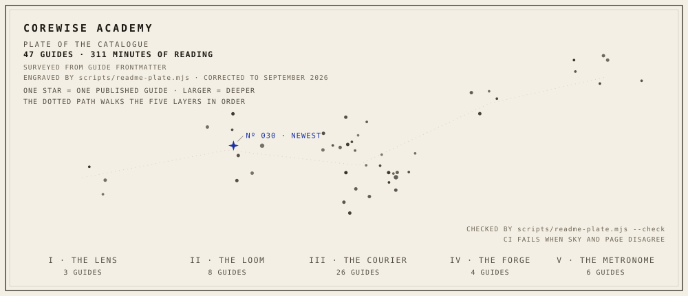

# CoreWise Academy

<!-- catalogue:plate -->
<picture>
  <source media="(prefers-color-scheme: dark)" srcset=".github/assets/plate-dark.svg">
  
</picture>
<!-- /catalogue:plate -->

CoreWise Academy is a free library of original guides on working with AI, published at [corewise.academy](https://corewise.academy). The site names its five curriculum layers after constellations and charts its catalogue as a sky, one star per guide. This repo is the observatory behind it. AI agents draft the guides, machines check the copy rules, and a human editor, [Ryan D. Allen](https://corewise.academy/about/), reads every draft before it publishes. The repo holds the guides, the site, and the scripts that keep both honest.

## The catalogue

<!-- catalogue:catalogue -->
37 guides, 250 minutes of reading, sorted into five layers, each guide at one of three depths (broad, practitioner, deep). 26 of them credit the videos and articles they started from, timestamps included; 11 are original field notes with no outside source.

| Layer | Constellation | Guides |
|---|---|---:|
| I · Foundations | THE LENS | 3 |
| II · Prompting & Context | THE LOOM | 7 |
| III · Agents & Automation | THE COURIER | 19 |
| IV · Building with AI | THE FORGE | 3 |
| V · Practice | THE METRONOME | 5 |
<!-- /catalogue:catalogue -->

The numbers above are not typed by hand. [`scripts/readme-plate.mjs`](scripts/readme-plate.mjs) writes them into this page from the guides themselves, and CI fails if they fall behind.

Every guide carries the same frontmatter contract ([`site/src/content.config.ts`](site/src/content.config.ts)): measurable objectives, prerequisites, cited sources, and exactly three self-check questions. A draft that does not fit the schema does not build.

## The plate above is generated, not drawn

One star is one published guide. Its position comes from a hash of the guide's catalogue number, its size from the guide's depth, and the one four-pointed star marks the newest guide. The position hash, the depth radii, and the star glyph are the same ones the homepage's own chart of the catalogue uses ([`site/src/pages/index.astro`](site/src/pages/index.astro)). [`scripts/readme-plate.mjs`](scripts/readme-plate.mjs) draws both SVGs, light and dark, and writes this page's counts, all from frontmatter; its `--check` mode runs in CI and fails the build when either falls behind the guides. Every mark states a fact: unpublish a guide and its star goes out. You can run the check yourself:

```bash
node scripts/readme-plate.mjs --check
```

## How a guide gets made

| Stage | What happens | What comes out |
|---|---|---|
| Ingest | A source video or document is broken down | Notes, plus a row in the source registry |
| Draft | An agent writes an original guide | MDX draft on a branch |
| Review | The editor reads and corrects | Published guide |
| Rebuild | Merging rebuilds the static site | Live page |

The ingest step fetches transcripts with [`scripts/transcript.mjs`](scripts/transcript.mjs) and logs every source in [`content/sources.md`](content/sources.md). Drafting is done by Claude Code running the repo's editorial skills in [`.claude/skills/`](.claude/skills/), which read the whole curriculum before writing. Every draft arrives as a pull request, and the editor merges it only after review: merging is publishing. The longer version is at [corewise.academy/how-its-built](https://corewise.academy/how-its-built/).

## The style book is enforced

The Academy keeps one written style book ([`.claude/reference/copy-rules.md`](.claude/reference/copy-rules.md)). The rules a machine can check run as scripts in [`site/scripts/`](site/scripts/) before every build:

| Script | Rule |
|---|---|
| [`no-em-dash.mjs`](site/scripts/no-em-dash.mjs) | No em dash anywhere on the site; one character fails the build |
| [`heading-length.mjs`](site/scripts/heading-length.mjs) | Titles and headings stay under a length cap; over fails the build |
| [`layout-check.mjs`](site/scripts/layout-check.mjs) | Flags prose that hides a list or table; advisory, the editor decides |

The same em dash rule covers this page: the plate check fails on one here too. The rest of the style book is held in review by the editor.

## For machine readers

The guides are written to be read by agents as well as people, so the site serves them both ways:

- [corewise.academy/llms.txt](https://corewise.academy/llms.txt) lists the whole catalogue with descriptions, by layer.
- Swap the trailing slash of any guide URL for `.md` and the guide comes back as plain markdown, ready to drop into an agent's context.

## Run it

```bash
cd site
npm install
npm run dev
```

`npm run build` runs the style scripts first, then `astro build`. The stack is Astro 5 with MDX and one three.js scene for the hero sky; those are the only runtime dependencies.

## What lives where

The display face on the site, Alembic Titling, is built rather than bought: [`design/typeface/build-alembic.mjs`](design/typeface/build-alembic.mjs) generates the `.otf` from stroke skeletons, so the lettering is reproducible from this repo.

| Path | What it is |
|---|---|
| [`site/`](site/) | The Astro site |
| [`site/src/content/guides/`](site/src/content/guides/) | The guides themselves, MDX with the frontmatter contract |
| [`content/sources.md`](content/sources.md) | The source registry every ingested video is logged in |
| [`design/`](design/) | Mockups and the typeface generator |
| [`scripts/`](scripts/) | The transcript fetcher and the plate generator |
| [`.claude/`](.claude/) | Agent instruction files (skills) and the reference library the pipeline runs on |

License: [MIT](LICENSE). Individual skills under `.claude/skills/` may carry their own licenses; see [`PROVENANCE.md`](.claude/skills/PROVENANCE.md).

The willaicite geo-audit tool that once lived here moved with full history to [ryanportfolio/willaicite](https://github.com/ryanportfolio/willaicite).
